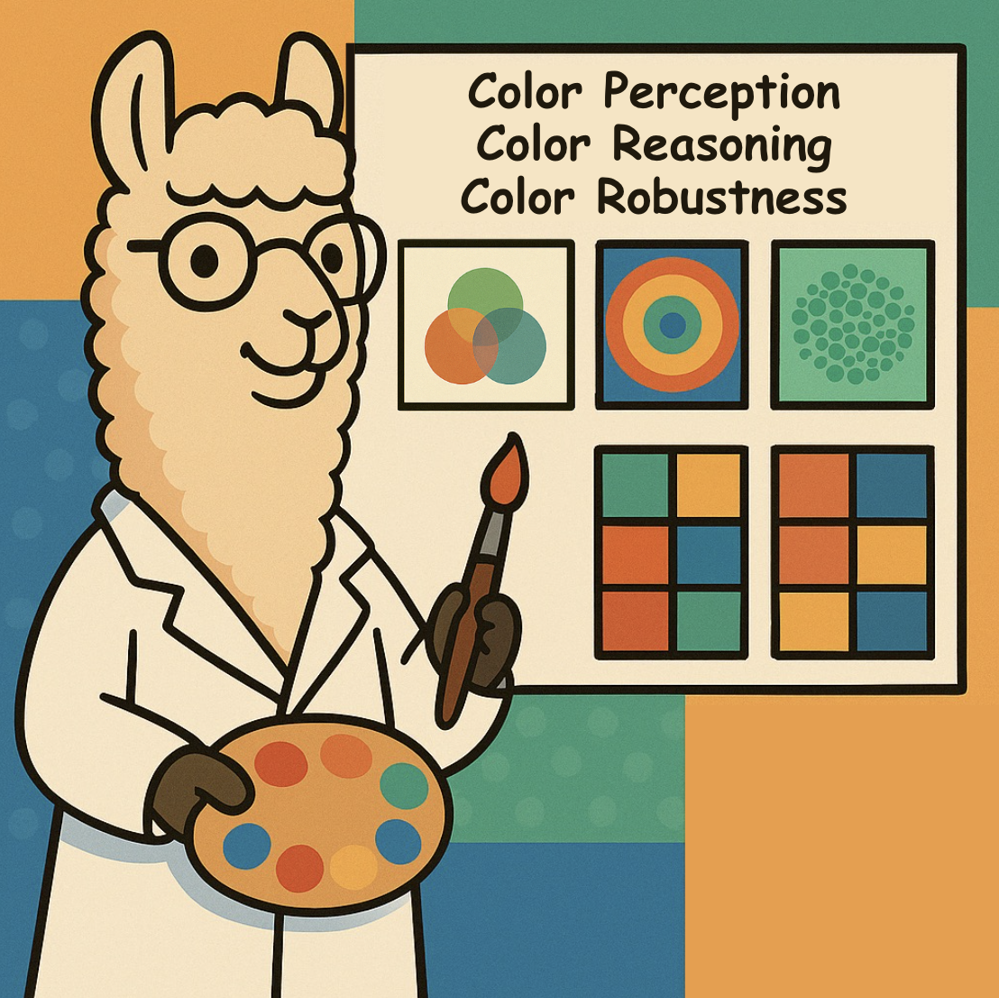
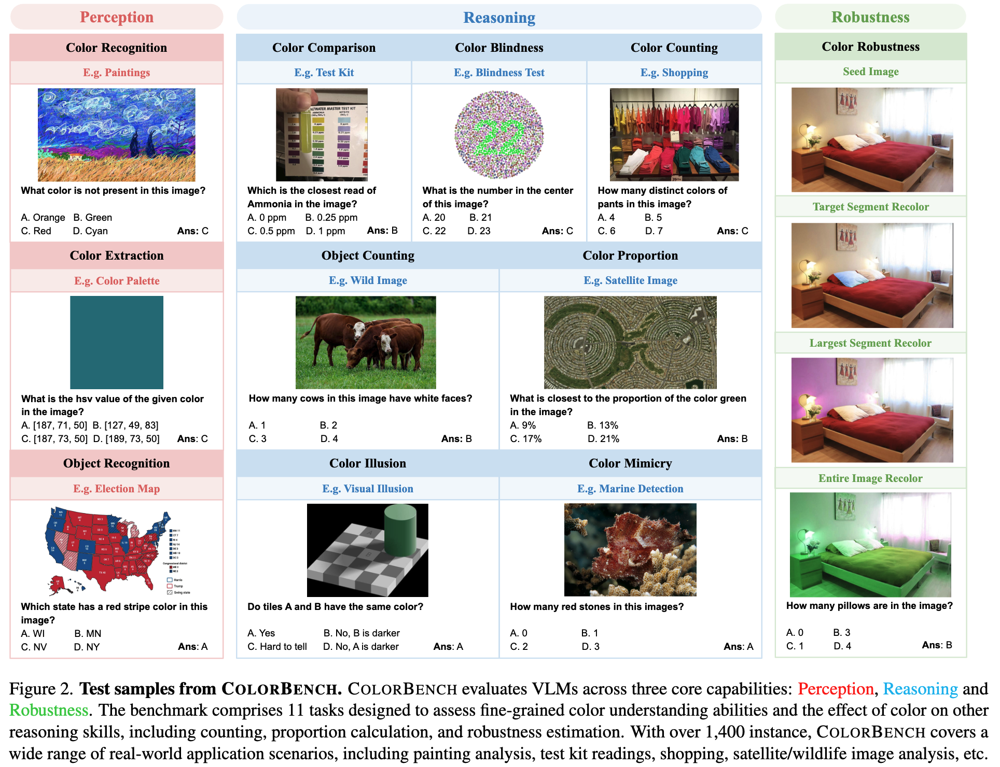
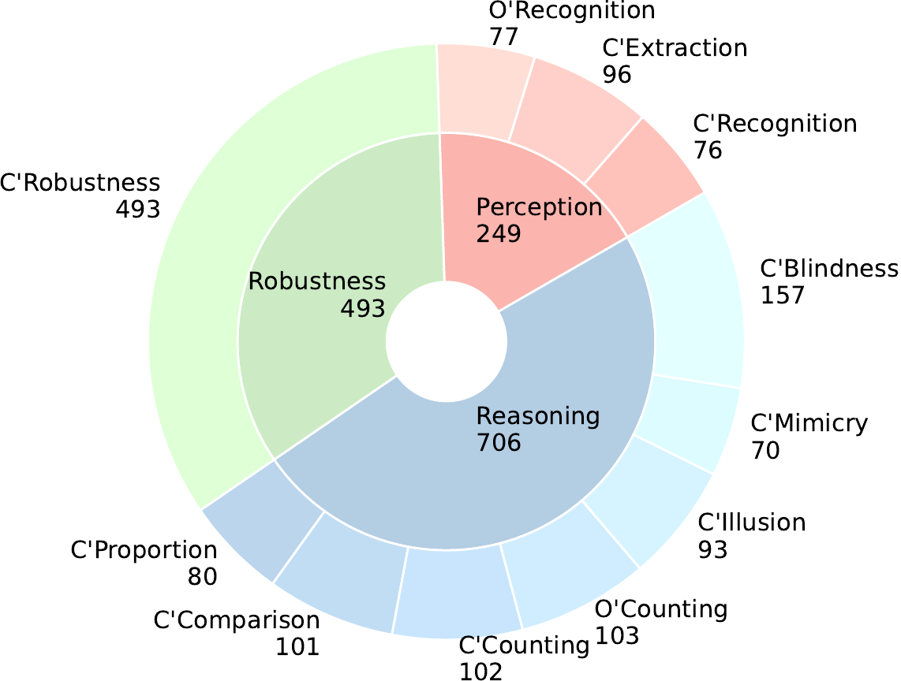
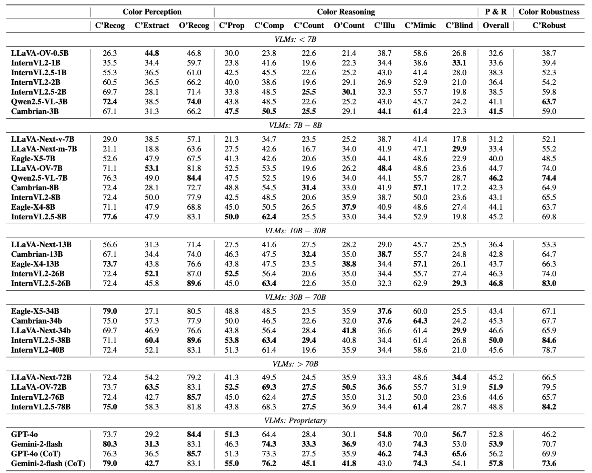

# 🎨 ColorBench

<p align="center" width="40%">
<a ></a>
</p>
This repo contains the official evaluation code and dataset for the paper "ColorBench: Can VLMs See and Understand the Colorful World? A Comprehensive Benchmark for Color Perception, Reasoning, and Robustness"<br>

## Highlights
- 🔥 **More than 5,800 image-text questions** covering diverse application scenarios and practical challenges for VLMs evaluation.
- 🔥 **3 categories and 11 tasks** for various color-centric capabilities evaluation including **Perception**, **Reasoning**, and **Robustness**. 

## Findings
- 🔎 **The scaling law for language and vision part:** The scaling law still holds for color understanding but is much weaker and mainly depends on the language model parts. 
- 🔎 **Absolute performance gap between different sizes of models:** The absolute performances of different VLMs are relatively low, and the gaps between different models (open-source vs. proprietary, small vs. large) are not large.
- 🔎 **Introducing reasoning steps:** Adding reasoning steps can still improve VLMs' performance on ColorBench tasks, even for color robustness.
- 🔎 **The effect of color clues:** Color clues are indeed leveraged by VLMs in most of the tasks. However, in color illusion and mimicry tasks, colors might mislead VLMs to give wrong answers, and converting colorful images into grayscale can improve the accuracy. 


## Dataset Introduction
<p align="center">
  
</p>

ColorBench is the first benchmark explicitly designed to comprehensively evaluate the color understanding capabilities of VLMs across three key dimensions: **Color Perception**, **Color Reasoning**, and **Color Robustness**. 
This benchmark consists of 1,448 instances and more than 5,800 image-text questions spanning 11 diverse tasks (Color Recognition, Color Extraction, Object Recognition, Color Proportion, Color Comparison, Color Counting, Object Counting, Color Illusion, Color Mimicry, Color Blindness, and Color Robustness).
For the Color Perception and Color Reasoning categories, each instance contains an image, a question, and multiple-choice (3 to 6) options, with only one correct answer. 
For Color Robustness, each instance consists of 10 multiple-choice image-text questions including a seed image and 9 edited images with color changes.

<p align="center">
  
</p>

## VLMs' Result
We conduct an extensive evaluation of 32 vision-language models (VLMs) spanning a range of large language model (LLM) sizes and architectures. Our evaluation includes state-of-the-art models such as GPT-4o, Gemini-2-flash, LLaVA-OV, LLaVA-NEXT, Cambrian-1, InternVL2, Qwen2.5-VL, and Eagle. This selection covers a diverse set of architectures, including both proprietary and open-source models, enabling a comprehensive assessment of their reasoning capabilities under different computational constraints.
<p align="center">
  
</p>

## Evaluation Pipeline
We provide detailed instructions for evaluation as follows. 

### Environment
Install packages that are necessary for VLMs. 
```bash
conda create -n colorbench python=3.11
conda activate colorbench

pip3 install -r requirements.txt
pip install flash-attn==2.7.3 --no-build-isolation
```

Install [Eagle1](https://github.com/NVlabs/EAGLE/blob/main/Eagle1/README.md#install) and [LLaVA](https://github.com/haotian-liu/LLaVA) in the directory follow the instructions in the official repo.

### Download Dataset
We release ColorBench on [Huggingface](https://huggingface.co/datasets/umd-zhou-lab/ColorBench), which more than 5,800 image-text pairs. You can download and view the dataset from Huggingface by the following command:

```bash
curl -X GET \
     "https://datasets-server.huggingface.co/rows?dataset=umd-zhou-lab%2FColorBench&config=default&split=test&offset=0&length=100"
```

### Inference with Models
Inference codes for some VLMs are prepared in [model](model/). You can use script [model_inference.sh](model_inference.sh) to run inference on our benchmark.

```bash
bash model_inference.sh
```
Before running [model_inference.sh](model_inference.sh), modify the necessary folder paths and API keys in model_inference.sh:

```bash
ROOT_DIR="PATH/TO/ROOT_DIR"          # Needed only if using json for model inference
RESULT_DIR="PATH/TO/RESULT_DIR"      # Path to save the model inference results
GEMINI_API_KEY="YOUR_API_KEY"
GPT4O_API_KEY="YOUR_API_KEY"
```

The cache folder for models and dataset can be modified in [path_utils.py](utils/path_utils.py). If not changed, the cache folder path defaults to the home directory.”:

```python
CACHE_DIR = "YOUR_HF_CACHE_FOLDER"
```

### Evaluation Results
We provide script [metrics_eval.py](evaluation/metrics_eval.py) to run evaluation metrics based on the inferenced resultsYou can run this command to get the final result:

```bash
python3 evaluation/metrics_eval.py --result_dir=RESULT_DIR --save_dir=SAVE_DIR
```
The final result will be saved in folder ```SAVE_DIR```. 
